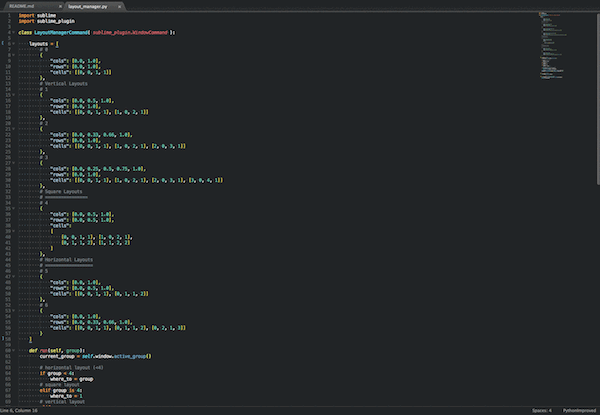

Layout Manager
=================
Sublime Text 3 plugin for sending the current file to a specific group of a panes layout.

With this plugin you can send the current file to a specific group (pane) and in addition if the layout is not already set then this pluign will set it up and focus on the file after it has been moved to the group.

###Usage Example

- Open a file
- Either:
  - Hit the shortcut `ctrl+shift+alt+2`
  - Open up the command panel and start to type: `layout ..` then chose `Layout Manager: send to group 2`
- If the layout has **at least 2 panes** (either vertically, horizontally or in squared layout) then the current file will be sent to the __2nd pane__ of the currently activated layout
- If the current layout has **less the 2 panes** (that is a single file layout) then it activates a 2 panes _vertical_ layout, then it moves the file to the 2nd group and focus on it.

###Standard Usage Shortcuts

| Shortcut              | Action        | Layout Creation  |
| --- | --- |---|
| ctrl+alt+shift+1      | send the file to the 1st group of the current layout | never creates a layout, use the current one.|
| ctrl+alt+shift+2      | send the file to the 2nd group of the current layout | creates a 2 panes vertical layout if the current layout has less than 2 panes.|
| ctrl+alt+shift+3      | send the file to the 3rd group of the current layout | creates a 3 panes vertical layout if the current layout has less than 3 panes.|
| ctrl+alt+shift+4      | send the file to the 4th group of the current layout | creates a 4 panes vertical layout if the current layout has less than 3 panes.|

In addition to the standard shortcuts for moving the current file to a pane this plugin provides extra shortcut for setting up specific layouts and send the file to a pane.

### Convenience shortcut for layout creations

| Shortcut              | Action        | Layout Creation  |
| --- | --- |---|
| ctrl+alt+shift+5      | send the file to the **1st** group of a squared layout | always create a squared (4 panes) layout.|
| ctrl+alt+shift+6      | send the file to the **2st** group of a horizontal (2 panes) layout | always create a horizontal (2 panes) layout.|
| ctrl+alt+shift+7      | send the file to the **3rd** group of a horizontal (3 panes) layout | always create a horizontal (3 panes) layout.|

###Notes

What is important to notice is that if the layout has been already created, either manually or automatically by this plugin then the standard shortcut will let us move the current file within the **currently activated** layout.

####Examples:
- If we are using a vertical 3 panes layout, the `ctrl+alt+shift+2` shortcut will send the file to the 2nd (vertical) pane
- If we are using a squared (4 panes) layout the same `ctrl+alt+shift+2` shortcut will send the file to the 2nd pane of the squared layout
- Similarly if we are using an horizontal 3 panes layout the same `ctrl+alt+shift+2` shortcut will send the current file to the 2nd (horizontal) pane.

####Commands
All the actions are also available trough the command panel: hit `super+shift+p` and start typing _layout .._. A list of commands starting with `Layout Manager: ..` will be visible, then chose the action you need to perform from the list.

###Author
Leonardo Gentile (https://github.com/LeonardoGentile)
